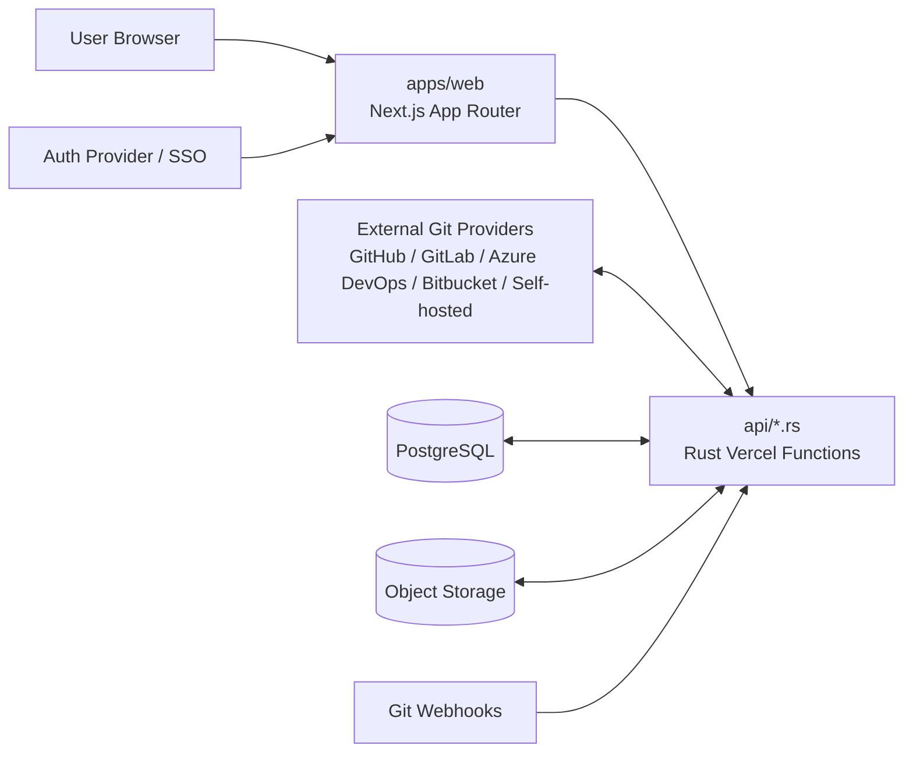

## Savant Rust backend spec

Yep — given the current repo direction, this is the backend spec I’d use.

The **most important design call** is this:

> If the backend is Rust and it must ship in **one Vercel project** with the Next.js frontend, the deployed Rust entrypoints should live in **repo-root `api/*.rs`**, not in api.

That matches Vercel’s Rust runtime model much better: Rust functions are compiled from files in `api/`, with a root `Cargo.toml`, while web remains the Next.js app inside the same monorepo.

## Core decision

Savant should use a **single Vercel project rooted at the repository root** with:

- web as the Next.js frontend
- `api/*.rs` as the Rust backend entrypoints
- `crates/*` as shared Rust libraries
- external Git providers as the source of truth for tenant-authored skill content
- Postgres/object storage as Savant-managed control-plane storage

This keeps:

- **one preview URL**
- **one production origin**
- **one Git repo**
- **one deployment unit**
- **one monorepo**
- but still allows a clean split between frontend and backend responsibilities

## Architectural intent

Savant’s Rust backend should own:

- Git-provider integration
- repository validation and provisioning
- skill ingest and manifest parsing
- release orchestration
- bundle preview/build metadata
- audit/event emission
- control-plane domain logic
- permission evaluation for backend operations

Savant’s Next.js frontend should own:

- UI rendering
- authenticated user flows
- session establishment
- server-side UX orchestration
- admin/catalog pages

## Topology



## Deployment model

### Single Vercel project

Use **one Vercel project** for the entire repo.

### Deployment root

Set the Vercel project to use the **repository root** as its deployment root, not web.

Reason:

- the frontend lives in web
- Rust Vercel Functions live in `api/*.rs`
- root-level project config is needed for shared deployment behavior

### Runtime split inside the same project

- web runs as the Next.js app
- `api/*.rs` compiles to Rust Vercel Functions
- the frontend and backend share the same origin
- preview deployments include both frontend and Rust API on the same preview URL

### Vercel-specific constraints this spec respects

From current Vercel docs:

- Rust is an **official** Vercel runtime, but currently **beta**
- Rust handlers live in `api/`
- Vercel Functions have a **read-only filesystem**
- writable scratch space is limited to tmp up to **500 MB**
- archived functions can incur noticeable cold start penalties
- direct `api/` files map to separate functions, so function sprawl should be avoided

## Monorepo layout

I would evolve the repo toward this shape:

```text
savant/
  apps/
    web/
      package.json
      next.config.ts
      src/
        app/
        components/
        lib/
        hooks/
        styles/

  api/
    health.rs
    repos.rs
    skills.rs
    releases.rs
    webhooks.rs

  crates/
    savant-domain/
    savant-http/
    savant-auth-context/
    savant-db/
    savant-git/
    savant-skills/
    savant-releases/
    savant-audit/
    savant-observability/

  packages/
    ui/
    types/
    schemas/

  db/
    migrations/
    schema/
    queries/

  skills/
    templates/
    registry/
    tier1/
    tier2/
    tier3/

  Cargo.toml
  Cargo.lock
  vercel.json
  package.json
  pnpm-workspace.yaml
  turbo.json
```

## Why `api/` + `crates/` instead of api

For a **single-project Vercel deployment**, api is the wrong deployment boundary.

Use:

- `api/` for **deployable Rust function entrypoints**
- `crates/` for **shared Rust logic**

That gives you:

- Vercel-native Rust deployment
- clean code reuse
- backend logic that can later move off Vercel if needed
- a thin function layer with a proper domain core

So in practice, api should be considered a placeholder from the earlier draft, not the final Rust deployment shape.

## Backend bounded contexts

The Rust backend should be split into these logical areas.

### Repository management

Responsible for:

- connecting an existing tenant repo
- validating credentials/access
- discovering repo layout
- checking compatibility with Savant’s template contract
- storing provider/repo metadata in Postgres

### Git provider abstraction

Responsible for provider-neutral operations:

- validate access
- fetch repository tree
- fetch archive/snapshot
- resolve branch/tag/commit
- create repository
- create branch/tag/commit
- register or validate webhooks
- verify webhook signatures

This layer must be interface-driven so the application does not assume GitHub-specific behavior.

### Skill ingest and resolution

Responsible for:

- reading repo-backed skill manifests
- validating repository layout
- indexing skills by tier/category
- materializing normalized metadata into Savant’s DB
- mapping skill versions to Git refs and manifest snapshots

### Release orchestration

Responsible for:

- resolving approved Git refs
- preparing release bundles/manifests
- writing release records
- storing bundle metadata
- tracking promotion state across environments

### Audit and compliance

Responsible for:

- immutable audit event creation
- access event logging
- repository connect/provision/change logs
- release and approval event trails

## API surface

Keep the number of Rust function entrypoints small.

### Recommended Rust function groups

| Function | Path prefix | Responsibility |
| --- | --- | --- |
| `api/health.rs` | `/api/health` | health/readiness/version |
| `api/repos.rs` | `/api/repos/*` | connect, validate, provision, repo metadata |
| `api/skills.rs` | `/api/skills/*` | ingest, list, inspect, resolve versions |
| `api/releases.rs` | `/api/releases/*` | preview bundle, promote, rollback, status |
| `api/webhooks.rs` | `/api/webhooks/git/*` | provider webhook intake and sync triggers |

This is better than one function per tiny route because it:

- reduces deployment sprawl
- keeps `Cargo.toml` bin config manageable
- limits cold-start fragmentation
- lets each function use an internal router

## Frontend-to-backend interaction model

Use a **BFF-style split**.

### Recommended pattern

- browser authenticates through web
- web owns session handling
- web calls Rust backend functions server-to-server
- Rust backend receives a short-lived internal auth context token or signed claims blob
- browser should not call privileged Rust endpoints directly except where explicitly allowed

### Why this split is better

It avoids duplicating enterprise auth complexity in two places.

So:

- **Next.js** handles auth/session UX
- **Rust** handles domain logic and protected control-plane actions

### Public endpoint exceptions

These can be public Rust endpoints:

- Git webhooks
- health checks
- optionally signed artifact download URLs or callback endpoints

## Git storage methodology

This spec assumes the model documented in tenant-skill-storage.md:

> tenant-authored skill content lives in a provider-agnostic external Git environment

### Source-of-truth split

#### External Git stores

- tiered skill packages and their authored commit history
- registry files and repo-local manifests
- safe baselines, datasets, fixtures, and rubrics kept as files
- templates, docs, and source-traceability assets
- authored commit history and branches

#### Savant stores

- orgs/users/groups
- RBAC
- provider connections
- release metadata
- audit logs
- eval runs/scorecards
- bundle metadata
- secrets and tokens

### Critical rule

A released skill version must resolve to:

- provider connection
- repository identity
- commit SHA or immutable ref
- validated manifest snapshot
- Savant release record

That gives reproducibility without making Savant own tenant-authored content storage.

## Repository interaction strategy

The Rust backend should prefer **provider APIs and archive/tree reads** over shelling out to `git`.

### Preferred approach

Use provider APIs for:

- listing files
- fetching archives
- resolving refs
- creating repos
- committing template content
- registering webhooks

### Avoid by default

- full `git clone` in request path
- dependence on system `git`
- large local working trees
- long-lived mutable disk state

### Why

Vercel functions are not a cozy little VM with infinite disk and patience.

They have:

- read-only filesystem
- only tmp scratch space
- request-duration constraints
- cold-start sensitivity

So the backend should be **API-first**, not shell-first.

## Data model additions

The Rust backend should treat these as first-class entities:

- `GitProviderConnection`
- `SkillRepository`
- `RepositoryWebhook`
- `Skill`
- `SkillVersion`
- `ManifestSnapshot`
- `Release`
- `ReleaseApproval`
- `AuditEvent`

### Key relationships

- one tenant can have many Git provider connections
- one skill repository belongs to one tenant/provider connection
- one skill has many versions
- one skill version resolves to a commit/ref + manifest snapshot
- one release promotes one skill version to one environment
- every repo connect/provision/sync/release action emits audit events

## Security model

### Authentication

- Next.js handles SSO/OIDC/SAML-facing session work
- Rust receives verified internal identity context from frontend server code
- webhook endpoints verify provider signatures independently

### Authorization

Rust must enforce:

- tenant boundary
- org/team/group-based permissions
- skill-level permissions
- release/approval permissions
- repo read vs repo write/provision permissions

### Secret handling

- store Git provider credentials outside repo content
- encrypt credentials at rest
- prefer installation/app-based auth where providers support it
- never persist tokens in manifests or Git files

### Audit requirements

Every sensitive action should emit a stable audit event, including:

- repo connected
- repo validated
- repo provisioned
- ingest started/completed/failed
- release preview created
- release promoted/rolled back
- webhook received/verified/rejected

## Observability

The Rust backend should emit:

- structured JSON logs
- OpenTelemetry traces
- stable error codes
- request IDs and trace IDs
- tenant/org/repo/release correlation fields

### Minimum metric set

- repo validation latency
- repo ingest latency
- release preview latency
- webhook processing latency
- provider API error rate
- permission denial rate
- bundle preview failure rate

### Recommended stable error codes

- `REPO_ACCESS_DENIED`
- `REPO_LAYOUT_INVALID`
- `REPO_PROVIDER_UNSUPPORTED`
- `MANIFEST_INVALID`
- `RELEASE_REF_UNRESOLVABLE`
- `PERMISSION_DENIED`
- `WEBHOOK_SIGNATURE_INVALID`

## Recommended Rust stack

I’d spec the backend around:

- `tokio` — async runtime
- `vercel_runtime` — Vercel Rust handler bridge
- `serde` / `serde_json` — contracts
- `reqwest` — provider API clients
- `sqlx` — typed Postgres access
- `tracing` / `tracing-subscriber` — logs and spans
- `thiserror` or equivalent — typed errors

### HTTP structure recommendation

Use:

- one Rust binary per top-level Vercel function file
- internal router per function group
- domain crates kept framework-light

That means the deployable function is thin, and the reusable logic lives in `crates/*`.

## Contract strategy with the frontend

Keep contracts explicit.

### Recommended source-of-truth split

- file/content schemas remain in schemas
- Rust owns backend transport contracts and validation logic
- generated or mirrored TS types land in types

### Rule

web should not invent backend request/response shapes ad hoc.

The Rust backend should define stable contracts for:

- repo validation results
- ingest summaries
- skill metadata projections
- release preview responses
- audit/event views

## Background work boundary

Even with Rust on Vercel, not everything belongs in the request path.

### Keep on Vercel

- repo validation
- metadata reads
- lightweight ingest
- release preview creation
- webhook intake
- approval and promotion orchestration

### Defer or move off hot path

- very large repo ingestion
- heavy bundle generation
- eval execution
- wide fan-out sync jobs
- long-running scoring pipelines

The domain logic can still be Rust, but those workloads may later run in a worker target without changing the core crates.

## Non-goals for v1

- full Git mirroring engine
- long-running eval/scoring inside Vercel request handlers
- direct browser access to privileged provider operations
- storing tenant production skill content primarily inside this repo
- provider-specific logic leaking into domain services

## Acceptance criteria

This backend spec is satisfied when Savant can:

1. deploy frontend and Rust backend in a **single Vercel project**
2. keep web as the frontend while using root `api/*.rs` for backend entrypoints
3. connect or provision provider-agnostic external Git repositories
4. validate tenant repo layout against Savant’s template contract
5. ingest repo-backed skill metadata into the control plane
6. resolve skill versions to immutable Git refs
7. create release previews and promotion records
8. enforce tenant-aware permissions on backend operations
9. emit audit events for repository and release actions
10. keep the Rust deployment adapter thin enough to move off Vercel later if needed

## My blunt architectural advice

If you adopt Rust, I would **change the planned backend shape** from:

- api as a standalone service

to:

- `api/*.rs` as Vercel entrypoints
- `crates/*` as the real backend codebase

That is the cleanest way to get:

- **single Vercel project**
- **single monorepo**
- **Rust backend**
- **Next.js frontend**
- **external Git-based tenant storage**

without fighting Vercel’s runtime model.

## Best next step

The next artifact I’d produce from this spec is:

1. a **repo tree proposal** showing exact Rust crate names and function files, then
2. a **backend API contract outline** for:
   - repo connect/validate/provision
   - skill ingest
   - release preview/promotion
   - Git webhook processing